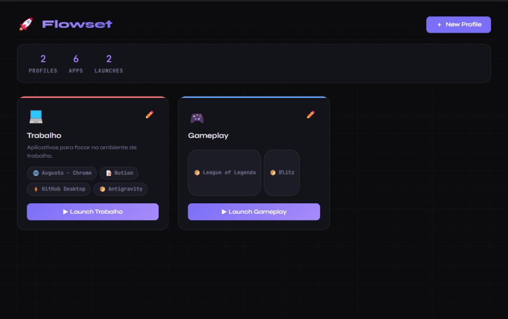
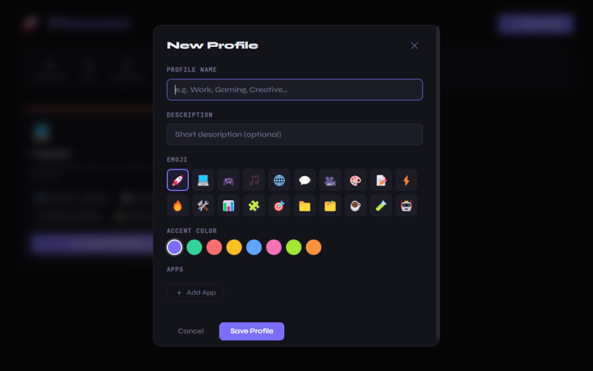

<p align="center">
  
  
  
  
  
  
</p>

<h1 align="center">🚀 Flowset</h1>

<p align="center">
  <strong>Troque de contexto na hora. Abra todos os seus apps com um clique.</strong>
</p>

<p align="center">
  Aplicativo desktop para Windows que permite criar perfis de trabalho personalizados<br/>
  e abrir grupos de aplicativos simultaneamente — sem precisar abrir um por um.
</p>

---

## 📸 Screenshots

<p align="center">
  
</p>

<p align="center">
  
</p>

---

## 💡 O Problema

Toda vez que você troca entre trabalho, estudo ou lazer, precisa abrir manualmente os mesmos aplicativos — editor de código, navegador, Slack, Spotify e por aí vai. É repetitivo, consome tempo e quebra seu fluxo.

**O Flowset resolve isso** permitindo que você crie perfis reutilizáveis que abrem todos os seus apps em sequência com um único clique.

## ✨ Funcionalidades

| Funcionalidade | Descrição |
|---|---|
| **Perfis personalizados** | Crie perfis com nome, emoji, cor de destaque e descrição |
| **Launch com um clique** | Abra todos os apps de um perfil em sequência, com indicador de progresso ao vivo |
| **Detecção automática de ícones** | Atribui emojis automaticamente com base no nome do app (VS Code → 💻, Chrome → 🌐, Discord → 💬) |
| **Persistência local** | Perfis e estatísticas ficam salvos localmente via `electron-store` |
| **Contador de launches** | Registra quantas vezes você lançou perfis — uma pequena métrica de produtividade |
| **Interface dark** | UI moderna com tema escuro, tipografia premium (Syne + JetBrains Mono) e animações suaves |

## 🛠️ Tecnologias

- **Electron** — framework para apps desktop multiplataforma (arquitetura main + renderer process)
- **JavaScript vanilla** — sem frameworks, controle total sobre DOM e gerenciamento de estado
- **HTML5 + CSS3** — UI customizada com animações CSS, glassmorphism e layouts responsivos em grid
- **electron-store** — persistência local leve baseada em JSON
- **electron-builder** — empacotamento em instalador `.exe` para Windows (NSIS)

## 🏗️ Arquitetura

```
flowset/
├── main.js            # Processo principal do Electron (janela, IPC handlers, store)
├── preload.js         # Context bridge (exposição segura da API para o renderer)
├── renderer/
│   ├── index.html     # Shell da aplicação com modais e estrutura semântica
│   ├── app.js         # Lógica de UI, gerenciamento de estado, event delegation
│   └── style.css      # Design system completo (tema escuro, animações)
├── package.json       # Dependências, config do build e electron-builder
└── .gitignore
```

**Decisões técnicas:**
- `contextIsolation: true` + `preload.js` para IPC seguro entre main e renderer
- Padrão de event delegation para elementos dinâmicos do DOM (cards de perfil, itens de app)
- `crypto.randomUUID()` para IDs de perfis — sem dependências externas

## 🚀 Como Rodar

**Pré-requisitos:** [Node.js](https://nodejs.org/) (v16+)

```bash
# Clone o repositório
git clone https://github.com/Augustuuuuu/flowset.git
cd flowset

# Instale as dependências
npm install

# Rode em modo de desenvolvimento
npm start
```

### Gerar o executável

```bash
npm run build
```

O instalador `.exe` será gerado na pasta `dist/`.

## 📖 Como Funciona

1. **Crie um perfil** — escolha um nome, emoji, cor de destaque e uma descrição opcional
2. **Adicione aplicativos** — navegue e selecione arquivos `.exe`, `.bat`, `.lnk` ou `.cmd` do seu sistema
3. **Inicie** — clique no botão de launch e veja o Flowset abrir cada app em sequência com uma animação de progresso

### Exemplos de perfis

| Perfil | Apps |
|---|---|
| 💻 **Trabalho** | VS Code, Chrome, Slack, Outlook |
| 📝 **Estudos** | Notion, Anki, YouTube, Terminal |
| 🎮 **Gaming** | Steam, Discord, Spotify |

## 📬 Contato

Feito por **Augusto Saboia** — [LinkedIn](https://www.linkedin.com/in/augustosaboia/)

---

<p align="center">
  <sub>Se achou útil, considere deixar uma ⭐</sub>
</p>
